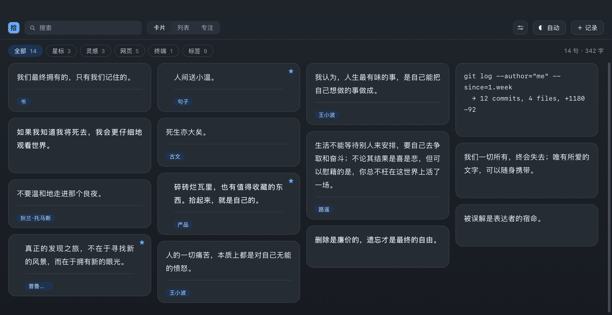
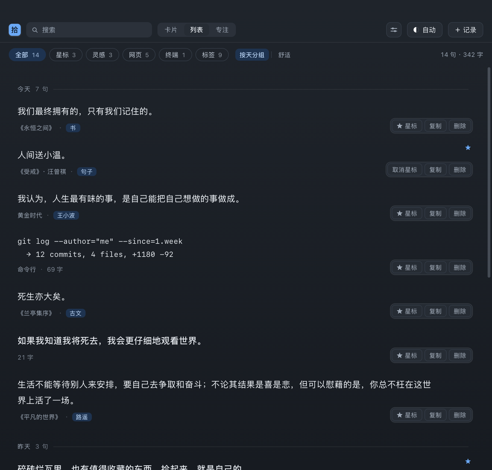
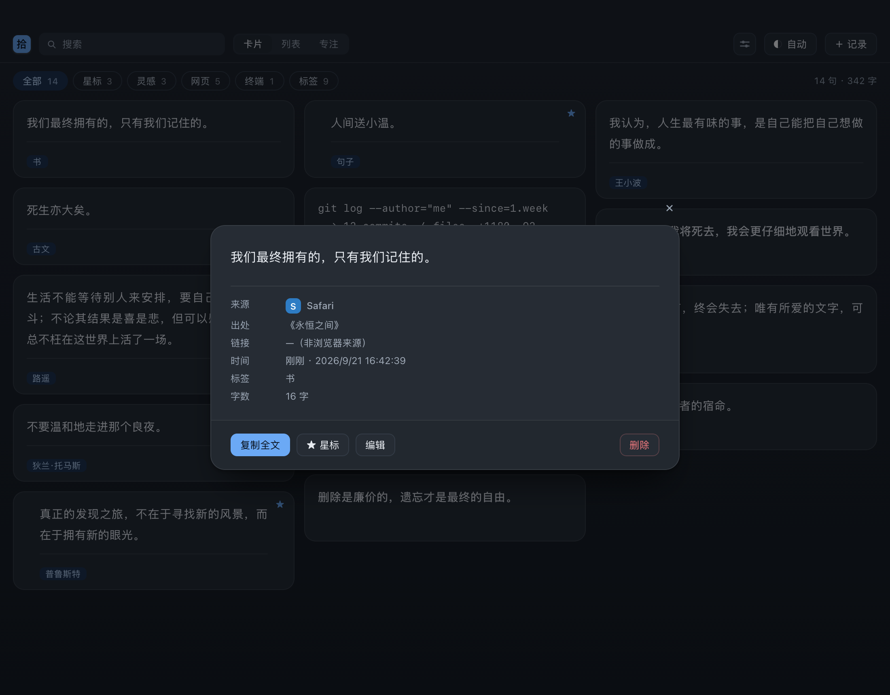
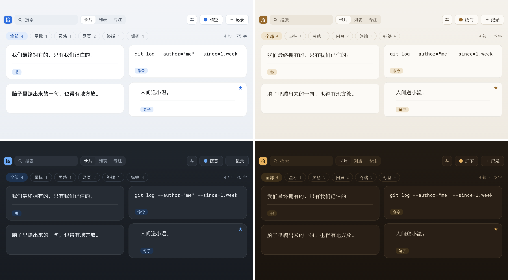

# 拾句

**选中，收录，不打扰。**

在任何应用里选中一段文字，右下角浮出一个按钮，点一下就存进你自己的卡片库。
灵感一闪而过的时候，也有地方可以放下。



`macOS 13+` · `Apple Silicon` · `菜单栏应用` · `数据全在本地` · [`MIT 协议`](LICENSE)

---

## 它解决什么问题

你有过这些时刻吗——

- 读到一句好话，截图存进相册，之后再也翻不到
- 复制到备忘录，和一堆待办、验证码、临时地址混在一起
- 在微信里看到朋友发的一段话想留着，只能塞进微信自己的收藏夹，越堆越乱
- 脑子里冒出来一句话，手边没有纸，两小时后就彻底忘了

这些东西有个共同点：**它们只有一句话，而你不会为它开一个文档、起一个标题、选一个文件夹。**

拾句就是给这些「一句话」准备的抽屉。选中 → 点一下 → 存好了，剩下的都不用管。

## 和备忘录、微信收藏有什么不一样

|              | 拾句                                     | 备忘录 / 微信收藏                      |
| ------------ | ---------------------------------------- | -------------------------------------- |
| 存一条要几步 | 选中，点一下                             | 切应用 → 新建 → 粘贴 → 想个标题 → 保存 |
| 会不会打断你 | 不会，原应用不失焦                       | 要切走再切回来                         |
| 出处         | **自动记下**应用名、网页标题、链接、时间 | 得自己写                               |
| 找回来       | 搜索 + 标签筛选 + 星标                   | 一条条翻                               |
| 数据在哪     | 你电脑上的一个 SQLite 文件               | 别人的服务器上                         |

「自动记下出处」不是场面话：在浏览器里收录，页面标题和链接会一起存进去，以后翻回来看还知道是从哪来的。

## 使用场景

**读东西的时候**
网页、电子书、PDF、公众号文章里看到一句想留的，选中就收。Safari / Chrome / Edge / Arc 里会连标题和链接一起记下。

**刷社交媒体的时候**
微博、小红书、即刻、X……看到写得好的，不用截图，选中就收。

**在微信里**
聊天记录、朋友圈、公众号文章都行。选中文字 → 点悬浮按钮。
微信是自绘界面，很多取词方案在它里面拿不到文字；拾句额外走了一条剪贴板通道，所以在微信里也能用。

**写代码、用终端的时候**
终端里报的错、一条跑通的命令，选中就存。命令行内容保留原样的换行。

**脑子里蹦出一句话的时候**
不用打开任何输入框。按 `⌥⌘C` 就能把当前选区收进库里；面板里的「＋ 记录」也可以手写一条，顺手打上标签。

**要写东西的时候**
搜索框敲两个字，或者点一个标签，之前的积累就摆出来了。

## 安装

### 方式一：下载安装包（推荐）

1. 到 [Releases](https://github.com/liulao-space/shiju/releases/latest) 下载 `Shiju-x.y.z.dmg`
2. 打开 dmg，把「拾句」拖进 Applications
3. **打开「终端」，粘贴下面这一行并回车**

   ```bash
   xattr -dr com.apple.quarantine /Applications/拾句.app
   ```

4. 从启动台或聚焦搜索（`⌘空格` 输入「拾句」）打开

> **第 3 步在做什么？**
> 拾句没有 Apple 开发者签名（那张证书一年 99 美元），所以 macOS 会拦下它。
> 上面这行命令就是把「这个文件是从网上下载的」这个标记去掉——它不做别的事，
> 也不需要管理员密码。去掉之后系统就不再拦了。
>
> 不想敲命令的话也可以：**右键**点「拾句」→ 打开 → 在弹窗里再点一次「打开」。
> 但**别直接双击**——双击只会弹一个「已损坏」的框，而那个框上没有「仍要打开」的按钮。

### 方式二：从源码构建

需要 macOS 13+ 和 Swift 5.9+（装了 Command Line Tools 就行，**不需要 Xcode**）。

```bash
git clone https://github.com/liulao-space/shiju.git
cd shiju
./Scripts/make-app.sh        # 编译 + 组装 dist/Shiju.app
./Scripts/install.sh         # 装到 /Applications/拾句.app 并启动
```

自己编出来的包在**本机**不会有上面那个 Gatekeeper 问题（本机构建的文件不带隔离标记）。
Intel Mac 也可以用这条路——发布出来的安装包只编译了 Apple Silicon。

## 首次运行：授予辅助功能权限

这是 macOS 的强制要求，**绕不过去**。没有它，选中文字时按钮不会出现。

1. 第一次打开「拾句」，它会弹一个框引导你
2. 点「打开系统设置」
3. 在 **隐私与安全性 → 辅助功能** 里把「拾句」勾上
4. 勾上立刻生效，**不用重启**

勾上之前，菜单栏图标会显示成 **「拾!」**（带感叹号），点它就能跳到授权页。正常之后是「拾」。

## 怎么用

拾句是个**菜单栏应用**：装完不会出现在 Dock 里，只在菜单栏右侧多一个「拾」字。

### 收录

| 操作                      | 效果                                         |
| ------------------------- | -------------------------------------------- |
| 选中文字后松开鼠标        | 右下角浮出「收录」按钮                       |
| 双击选一个词 / 三击选一行 | 同上                                         |
| `⌘C` 或右键菜单「复制」   | 同上。复制本身就是一次收录意图，**不用划选** |
| 点「收录」                | 存进库，3 秒内可以再点一次撤销               |
| `⌥⌘C`                     | 不点按钮，直接收录当前选区                   |
| 面板里「＋ 记录」         | 手动写一条，可填标签、出处、链接             |

### 打开面板

| 操作               | 效果                                                   |
| ------------------ | ------------------------------------------------------ |
| 左键点菜单栏「拾」 | 打开卡片面板                                           |
| `⌥⌘S`              | 同上                                                   |
| 右键点菜单栏「拾」 | 菜单：快捷键设置 / 暂停捕获 / 权限 / 数据库位置 / 退出 |

收录之后**不会自动弹面板**——那会打断你手头的事。想看库就按 `⌥⌘S`。

### 面板里

| 操作                 | 效果                                 |
| -------------------- | ------------------------------------ |
| `/`                  | 聚焦搜索框                           |
| `j` / `k`            | 上下移动                             |
| `Enter`              | 打开详情                             |
| `e`                  | 编辑正文与标签                       |
| `s` / `c` / `Delete` | 星标 / 复制 / 删除（删除前会问一次） |
| `g` / `l` / `f`      | 卡片 / 列表 / 专注视图               |
| `1`–`9` / `0` / `t`  | 切主题 / 回自动 / 循环               |
| 拖顶栏空白处         | 移动面板                             |
| 拖面板右边缘         | 改变宽度，一行几列会跟着变           |

筛选栏里的「标签」是按标签**精确**筛选（列出所有标签和条数）；
点卡片上的标签则是拿它当关键词做**全文搜索**——两件事，都在。

### 快捷键可以自己改

入口是面板顶栏的**滑杆图标**，或者右键菜单栏图标 →「快捷键设置…」。
点一下方框，按下你想要的组合就行。

> 组合里至少要有一个 `⌘` / `⌥` / `⌃`。只按一个字母的话，那个键会被从**所有**应用手里抢走，你就没法打字了。
> 如果组合已经被别的应用占用，窗口里会直接告诉你，并且保留原来的设置。

### 另外两个视图





卡片上只有句子和标签。**来源、出处、链接、时间都在详情弹窗里**——卡片是拿来扫读的，多一行就少看一张。

### 主题

内置 10 个主题，浅色深色各 5 个：

- **浅色**：晴空（默认，冷白干净）、苔绿、雾蓝、纸间（纸书质感，暖米 + 宋体）、丹宁
- **深色**：夜览（中性不偏色）、灯下（深夜暖光）、石墨、沉褐、水墨（电子纸单色）

下面是其中四个：



面板里按 `1`–`9` 直接切，`0` 回到「跟随系统」，`t` 循环下一个。选过的会记住。

## 数据与隐私

- 内容全部存在**你自己电脑上**：`~/Library/Application Support/Shiju/library.db`
- 单个 SQLite 文件，复制走就是完整备份
- **没有账号、没有云同步、没有统计上报**，也不联网
- 「删除」会先问一次；确认之后就是永久的（面板没有回收站入口）

## 常见问题

**装了之后找不到它？**
它是菜单栏应用，没有 Dock 图标。看屏幕**右上角**的菜单栏，找那个「拾」字。
确认它在跑：`pgrep -fl "Contents/MacOS/Shiju"`

**选中文字没有反应？**
十有八九是辅助功能权限没给。看菜单栏图标是不是「拾!」，点它去授权。
还不行就看诊断日志：`cat ~/Library/Application\ Support/Shiju/diagnostics.log`

**怎么卸载？**
把「拾句」从应用程序文件夹里删掉，再删掉 `~/Library/Application Support/Shiju/`。
如果系统设置 → 辅助功能 里还留着条目，用列表下方的「−」删掉。

## 已知限制

- **Canvas 渲染的界面读不到选区**：Google Docs、Figma、部分 Java 应用。这是物理限制，不是 bug。
- **浏览器链接只覆盖 Safari / Chrome / Edge / Arc**，而且第一次取链接时系统会弹一次「自动化」授权框。
- **键盘选择（`⇧`+方向键、`⌘A`）不触发按钮**：按钮的位置跟着鼠标走，键盘选择没有有意义的锚点。这类情况用 `⌥⌘C`，或者按一下 `⌘C`。
- **搜索用的是 `LIKE` 而不是全文索引**：SQLite 的 FTS5 对中文分词不好使（中文两字查询极常见）。当前数据量下是毫秒级，没有感知。
- **松手到按钮出现有几十到几百毫秒的延迟**：取词链路上要查一次窗口标题、可能还要模拟一次 `⌘C`。
- 忽略名单（密码框、拾句自己）目前写死在代码里，还没有设置界面。

取词能力来自 [SelectedTextKit](https://github.com/tisfeng/SelectedTextKit)（MIT）。
